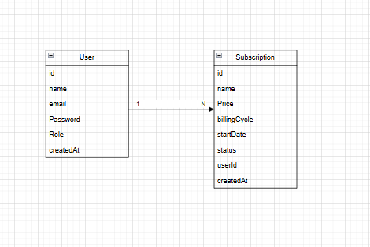
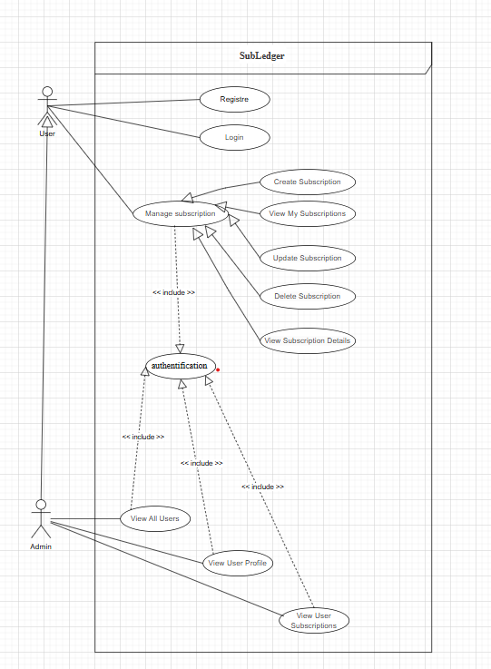

# SubLedger API

Backend API for managing digital subscriptions with authentication, authorization, and secure access control.

## Overview

SubLedger is a FinTech backend service that allows users to manage their digital subscriptions.  
The system provides secure authentication using JWT and role-based authorization to separate user and admin capabilities.

## Tech Stack

- Node.js
- Express.js
- MongoDB
- Mongoose
- JWT (JSON Web Token)
- bcrypt
- Joi / Express-validator

## Core Features

### Authentication

Users can register and log in.

**Registration**
- name
- email (unique)
- password (hashed with bcrypt)

**Login**
- email
- password

Successful authentication returns a **JWT token** used to access protected routes.

### Authorization

Two roles exist in the system:

- **User**
  - manage personal subscriptions
- **Admin**
  - access administrative routes

Role verification is handled through middleware.

### Protected Routes

All subscription routes require a valid JWT.

Authentication middleware:

- verifies JWT
- identifies the authenticated user
- blocks requests with missing or invalid tokens

## Subscription Management

Each subscription contains:

- `name`
- `price`
- `billingCycle` (monthly | yearly)
- `createdAt`
- `userId`

Rules:

- price must be greater than **0**
- users can access **only their own subscriptions**

## Admin Routes

Example admin endpoint:

| Method | Endpoint |
|------|------|
| GET | `/admin/users` |

Accessible only to users with the **admin role**.

## Input Validation

Validation handled with **Joi / Express-validator**.

Examples:

User validation:
- valid email
- required password

Subscription validation:
- name required
- price > 0
- billingCycle must be `monthly` or `yearly`

Errors returned as structured JSON responses.

## Project Structure

Pour install tout depandances principales : 
    npm install express mongoose bcrypt jsonwebtoken dotenv cors morgan
    
Validation.

npm install joi

Sécurité.

npm install helmet express-rate-limit

Dépendances développement.

npm install --save-dev nodemon

